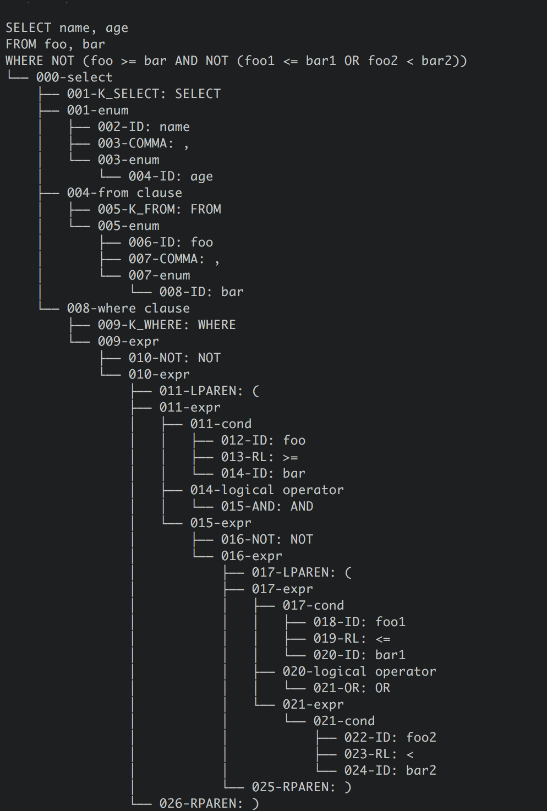

# Coursework 2015-2016
## Recursive descent parser
Simple parser for SQL-like expressions that follows the structure of the grammar below:
```
SELECT -> K_SELECT ENUM FROM WHERE
        | K_SELECT ENUM FROM
FROM   -> K_FROM ENUM
ENUM   -> ID | ID COMMA ENUM
WHERE  -> K_WHERE EXPR
EXPR   -> COND L_OP EXPR
        | NOT EXPR
        | LPAREN EXPR RPAREN
        | COND
L_OP   -> AND | OR
COND   -> ID RL ID
```

## Example
As example we took the following sql expression:
```SQL
SELECT name, age
FROM foo, bar
WHERE NOT (foo >= bar AND NOT (foo1 <= bar1 OR foo2 < bar2))
```
Screenshot below represents parse tree for given expression:

